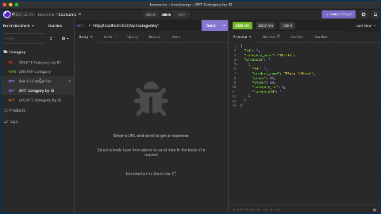

  # Backend for Ecommerce Site

  ## Description
  
  The project is designed to demonstrate CRUD operations using an API tool like Insomnia or Postman. A user can get, put, post, or destroy by ID or a by a whole table.
  
  ## Table of Contents
    
  - [Installation](#installation)
  - [Usage](#usage)
  - [Starting the Program](#starting-the-program)
  - [Author](#authors)
  - [Tests](#tests)
  - [Credits](#credits)
  - [License](#license)
  
  ## Installation
  
  For installation, https://github.com/sevrinbe/ecommerce-backend is needed and a terminal to clone the repo onto a local machine.

  ## Usage
  
  To demonstrate my ability to create a backend using CRUD operations.
  

  ## Starting the Program

  Type `npm start` in the terminal to execute.

  ## Authors
  
  Sevrin Eldred
  
  
  
  ## License
  
    Permission is hereby granted, free of charge, to any person obtaining a copy of this software and associated documentation files (the "Software"), to deal in the Software without restriction, including without limitation the rights to use, copy, modify, merge, publish, distribute, sublicense, and/or sell copies of the Software, and to permit persons to whom the Software is furnished to do so, subject to the following conditions:
      
    The above copyright notice and this permission notice shall be included in all copies or substantial portions of the Software.
      
    THE SOFTWARE IS PROVIDED "AS IS", WITHOUT WARRANTY OF ANY KIND, EXPRESS OR IMPLIED, INCLUDING BUT NOT LIMITED TO THE WARRANTIES OF MERCHANTABILITY, FITNESS FOR A PARTICULAR PURPOSE AND NONINFRINGEMENT. IN NO EVENT SHALL THE AUTHORS OR COPYRIGHT HOLDERS BE LIABLE FOR ANY CLAIM, DAMAGES OR OTHER LIABILITY, WHETHER IN AN ACTION OF CONTRACT, TORT OR OTHERWISE, ARISING FROM, OUT OF OR IN CONNECTION WITH THE SOFTWARE OR THE USE OR OTHER DEALINGS IN THE SOFTWARE.

  ## Badges
  
  
 
  ## Tests
  
  N/A
